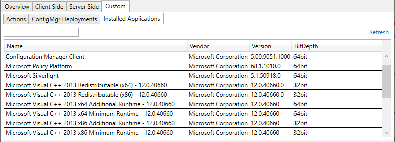
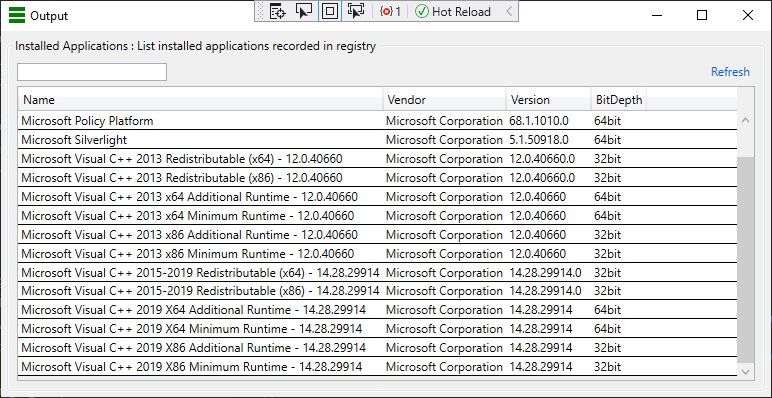

# Custom Actions


* [Adding a Custom Action](#adding-a-custom-action)
* [Metadata](#metadata)
* [Output](#output)
  * [Logging](#logging)
  * [Data](#data)
    * [**DisplayElement**: Tab](#displayelement-tab)
    * [**DisplayElement**: Modal](#displayelement-modal)
    * [**DisplayElement**: Log](#displayelement-log)
    * [**DisplayElement**: None](#displayelement-none)
    * [**OutputType**: List](#outputtype-list)
    * [**OutputType**: Object](#outputtype-object)
    * [**OutputType**: Text](#outputtype-text)
    * [**OutputType**: None](#outputtype-none)


Custom actions are simply PowerShell scripts that will be run on the remote device. They are available from the Custom tab.


---

## Adding a Custom Action

To add a custom action, copy your custom .ps1 script file to the **Scripts\Custom** folder. If DevChecker is already running, you can click *Refresh Custom Actions* on the Custom\Actions tab.

**Note:** Be aware of the WinRM [double hop](https://docs.microsoft.com/en-us/windows/win32/winrm/multi-hop-support) problem if your script needs to access network shares. 

---

## Metadata

Metadata can be added to your script to control how your custom action is presented in the DevChecker UI.

To add metadata, copy and paste the following somewhere in your PowerShell script. This is a comment block so will not effect the functionality of your script. 

```json
<#ActionSettings
{
    "Description": "List deployments for the connected client",
    "DisplayElement": "Tab",
    "DisplayName": "ConfigMgr Deployments",
    "FilterProperties": ["TargetName", "CollectionName"],
    "LogOutput": false,
    "LogScriptContent": false,
    "MaxRowsPerColumn": 100,
    "OutputType": "List",
    "RequiresServerConnect": true,
    "RunOnClient": false,
    "RunOnConnect": false,
}
ActionSettings#>
```

Update the fields appropriately:
* **Description**: The description to appear in DevChecker
* **DisplayElement**: How to display the output. Valid options (case sensitive): 
  * [Tab](#displayelement-tab)
  * [Modal](#displayelement-modal)
  * [Log](#displayelement-log)
  * [None](#displayelement-none)
* **DisplayName**: The name to be shown in DevChecker. If this is empty the script name will be used
* **FilterProperties**: When displaying in a table view, the search box will filter the view based on a match against the properties listed here
* **LogOutput**: Will log the output of the script, even if DisplayElement is Tab or Modal
* **LogScriptContent**: Set this to true to output the content of the script file to the logging pane in DevChecker
* **MaxRowsPerColumn**: When outputting an object, you can split the list of properties into columns. A new column will be created per *MaxRowsPerColumn* properties
* **OutputType**: Define the expected output of the script. Valid options (case sensitive): 
  * [List](#outputtype-list)
  * [Object](#outputtype-object)
  * [Text](#outputtype-text)
  * [None](#outputtype-none)
* **RequiresServerConnect**: If RunOnClient is false, this will prevent the action from running if the server has been connected
* **RunOnClient**: Run the script on the connected client. If false, will run on the computer DevChecker is running on.
* **RunOnConnect**: Automatically run the script on connect to a device

The json in the comment block will be parsed when the script is read to create the appropriate configuration.


---
## Output

### Logging
DevChecker will capture Write-Information, Write-Warning, Write-Error etc. from your script and output it to the *Output* pane.

If you wish to highlight your text in the Output pane, add **\*\*** to the start of your message.


### Data
The output of your script can be viewed in a number of ways. These are configured in the custom script [metadata](#metadata) using the **DisplayElement** and **OutputType** fields:

#### **DisplayElement**: Tab
Add an additional tab to the Custom tab area. This DisplayElement type is only supported with the the **List** OutputType. If DisplayElement is not set to Tab the custom action will be listed in the Custom\Actions pane.



#### **DisplayElement**: Modal
Open a new modal window for your output



#### **DisplayElement**: Log
Log to the output pane


#### **DisplayElement**: None
No output, just run the script

#### **OutputType**: List
List of PowerShell objects


#### **OutputType**: Object
A single PowerShell object created from a hashtable

#### **OutputType**: Text
Simple text output

#### **OutputType**: None
No output